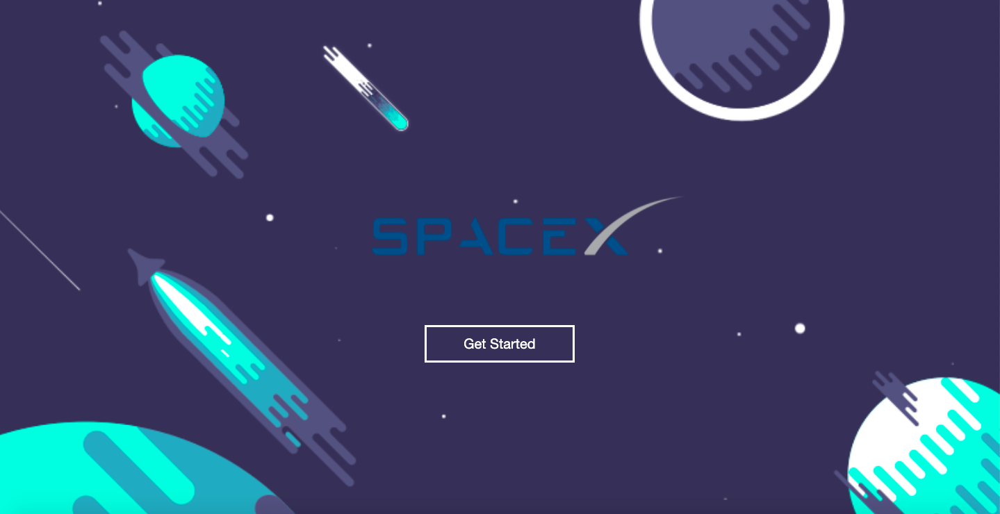
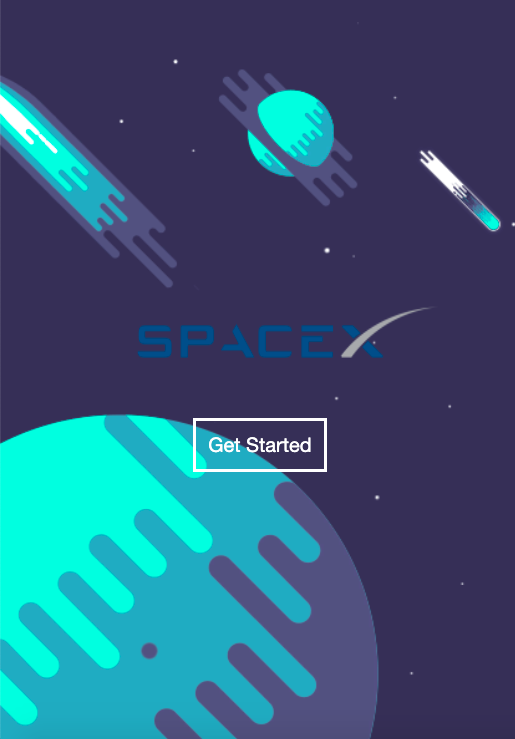
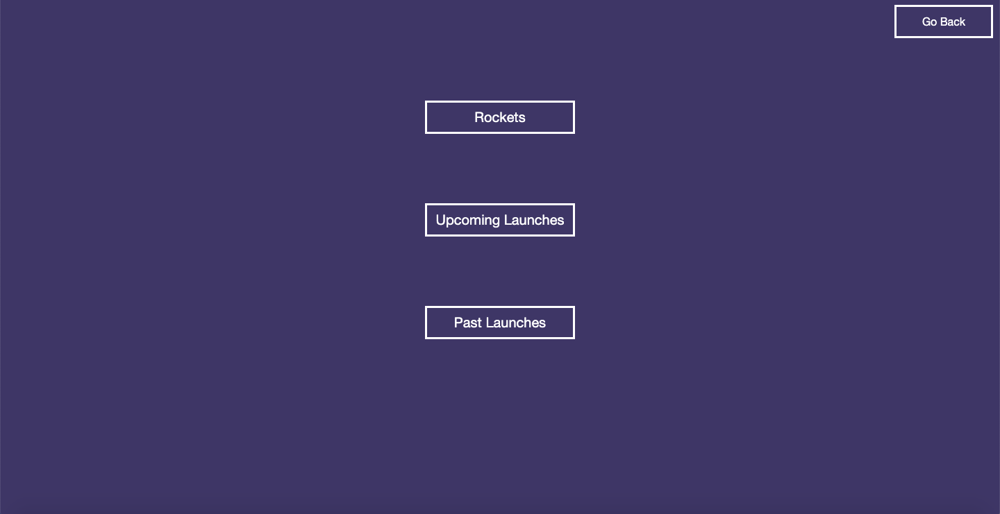
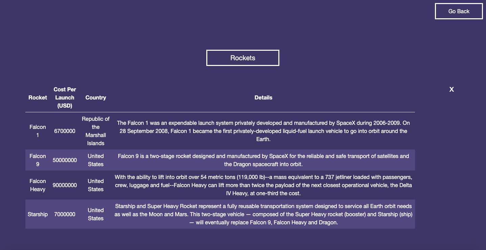
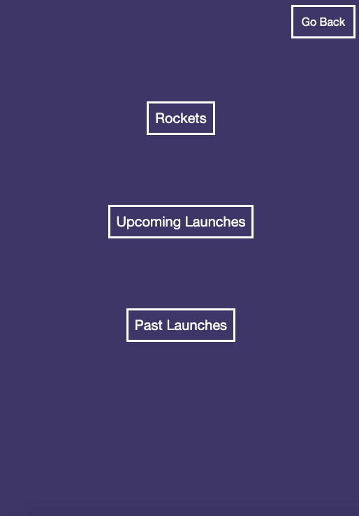
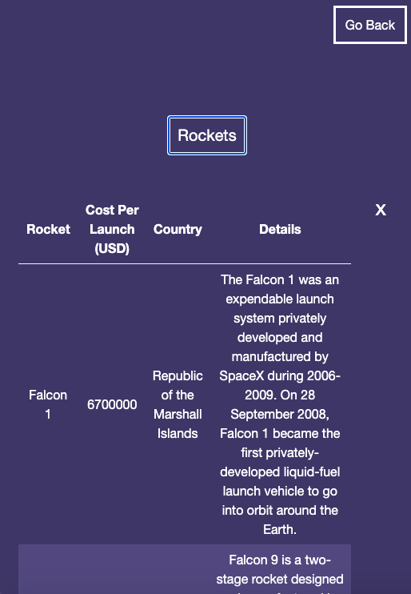

# Mini SpaceX App 

An app that displays tabular information about rockets, upcoming and past launches.

Live :


# Screenshots

Landing page:

# Tablet/Desktop View



# Mobile View



Tables View :

# Tablet/Desktop View





# Mobile View






# API Endpoints


### GET
- /api.spacexdata.com/v3/rockets (Rockets)
- /api.spacexdata.com/v3/launches/upcoming (Upcoming Launches)
- /api.spacexdata.com/v3/launches/past (Past Launches)


# Environment Set Up

* npm install
* npm run start


# Run Tests

* To run all tests, run : ```npm test```


# Built With

## Front-End/NPM Packages
* React
* React Hooks 
* React-Router
* React-Table
* Date-fns


## Testing

* Jest


# Acknowledgments

* Landing page animation borrowed from Michael Taiwo https://dribbble.com/shots/6847700-Space-Flat-Design